# Kubernetes Cloud Dashboard

A containerized web application deployed and managed with Kubernetes on Docker Desktop, with Docker image build and publishing automated through GitHub Actions and Docker Hub.

The project demonstrates Docker containerization, Kubernetes workload management, service exposure, scaling, self-healing, rolling updates, configuration management, health checks, resource management, and CI/CD.

## Project Overview

This project implements a containerized Cloud Operations Dashboard deployed and managed with Kubernetes on Docker Desktop.

It demonstrates Docker containerization, Kubernetes workload management, configuration, health checks, resource management, and CI/CD image publishing through GitHub Actions and Docker Hub.

The final implementation includes:

- Kubernetes Deployment with 2 replicas
- NodePort Service
- ConfigMap-based Nginx configuration
- Liveness and readiness probes
- CPU/memory resource requests and limits

GitHub Actions builds and publishes the Docker image to Docker Hub, while Kubernetes deployment and runtime management are performed separately on the local Docker Desktop cluster.

---

## Architecture Diagram

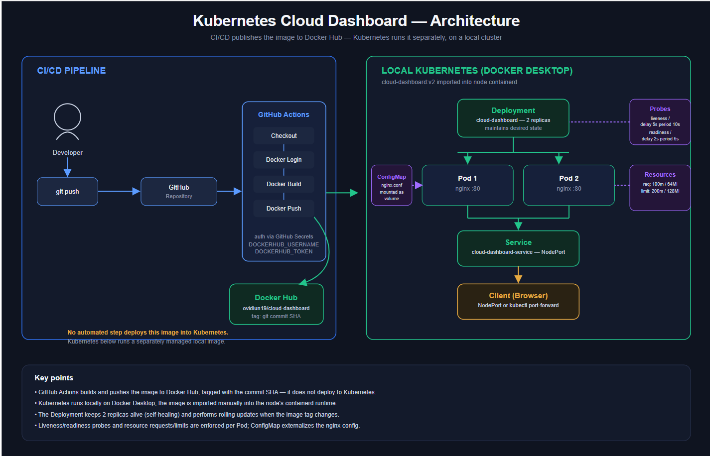

The diagram separates the CI/CD pipeline from the local Kubernetes runtime: GitHub Actions builds and publishes the image to Docker Hub, while Kubernetes runs a separately managed local Deployment, Service, ConfigMap, and Pods with health checks and resource limits.

---

## Project Summary

| Technology | Purpose |
|---|---|
| HTML / CSS | Web application |
| Nginx | Web server |
| Docker | Containerization |
| Kubernetes | Container orchestration |
| Docker Desktop | Local Kubernetes environment |
| NodePort | Application exposure |
| ConfigMap | Externalized configuration |
| GitHub Actions | CI/CD automation |
| Docker Hub | Container registry |
| Git / GitHub | Version control |

---

## Project Evolution

The project was built incrementally:

```text
Application
    ↓
Docker
    ↓
Kubernetes Deployment
    ↓
Service
    ↓
Scaling & Self-Healing
    ↓
Rolling Update
    ↓
ConfigMap
    ↓
Health Checks & Resources
    ↓
GitHub
    ↓
GitHub Actions
    ↓
Docker Hub
```

Each stage adds a specific operational capability to the application rather than introducing unnecessary infrastructure.

---

## Version Control

The project is versioned with Git and hosted on GitHub.

The repository was initialized locally and connected to a remote:

```bash
git remote add origin https://github.com/OvidiuN19/kubernetes-cloud-dashboard.git
```

Temporary Docker image archives are excluded via `.gitignore`:

```text
*.tar
```

Changes were committed incrementally throughout the project and pushed to `master`.

---

## Kubernetes Components

### Deployment

The application is managed through a Kubernetes Deployment with 2 replicas.

The Deployment maintains the desired state of the workload and manages the underlying Pods.

```bash
kubectl apply -f kubernetes/deployment.yaml
kubectl get deployment
kubectl get pods
```

The final Deployment uses `cloud-dashboard:v2`.

### Service

A NodePort Service provides stable access to the application Pods.

```text
Client
   ↓
Service
   ↓
Pods
```

The Service and its endpoints were verified with:

```bash
kubectl get services
kubectl get endpoints cloud-dashboard-service
```

Local browser access was also verified using:

```bash
kubectl port-forward service/cloud-dashboard-service 8080:80
```

### Scaling & Self-Healing

The application was scaled to two replicas:

```bash
kubectl scale deployment cloud-dashboard --replicas=2
```

Self-healing was demonstrated by deleting a Pod and observing Kubernetes automatically create a replacement.

This demonstrates the Kubernetes reconciliation model:

```text
Desired state: 2 Pods
       ↓
Pod deleted
       ↓
Kubernetes detects the difference
       ↓
Replacement Pod created
       ↓
2 Pods restored
```

### Rolling Update

A second application version was created:

```text
cloud-dashboard:v1
        ↓
cloud-dashboard:v2
```

The Deployment was updated with:

```bash
kubectl set image deployment/cloud-dashboard cloud-dashboard=cloud-dashboard:v2
kubectl rollout status deployment/cloud-dashboard
```

Because Kubernetes runs locally through Docker Desktop, the v2 image had to be available in the node's `containerd` runtime.

This demonstrated the difference between an image existing in Docker Desktop and an image being available to the Kubernetes node runtime.

### ConfigMap

Nginx configuration was externalized using:

```text
kubernetes/configmap.yaml
```

The configuration is mounted into the container:

```text
ConfigMap
    ↓
Volume
    ↓
/etc/nginx/conf.d/default.conf
    ↓
Nginx
```

The configuration was validated through HTTP using the `X-Environment: production` response header.

### Health Checks & Resource Management

The Deployment defines both liveness and readiness probes.

```yaml
livenessProbe:
  httpGet:
    path: /
    port: 80

readinessProbe:
  httpGet:
    path: /
    port: 80
```

Liveness determines whether the application is still functioning, while readiness determines whether the Pod is ready to receive traffic.

CPU and memory resources are also defined:

```yaml
resources:
  requests:
    cpu: "100m"
    memory: "64Mi"
  limits:
    cpu: "200m"
    memory: "128Mi"
```

The probes were verified on a running Pod with `kubectl describe pod`, confirming the configured HTTP checks, with liveness running every 10 seconds after a 5-second delay and readiness every 5 seconds after a 2-second delay. Both probes use a failure threshold of 3, and the Pod reported `Ready: True`.

---

## CI/CD

### GitHub Actions

The CI/CD workflow is defined in:

```text
.github/workflows/ci.yml
```

The workflow performs:

```text
Git push
    ↓
Checkout
    ↓
Docker Login
    ↓
Docker Build
    ↓
Docker Push
    ↓
Docker Hub
```

Docker Hub authentication uses GitHub Secrets:

- `DOCKERHUB_USERNAME`
- `DOCKERHUB_TOKEN`

The Docker image is tagged using:

```yaml
${{ github.sha }}
```

This provides traceability between the Docker image and the Git commit that produced it.

### Docker Hub

The resulting image is published to:

```text
ovidiun19/cloud-dashboard
```

with the commit SHA used as the image tag.

The CI/CD workflow successfully completed:

```text
Checkout          ✓
Docker Login      ✓
Docker Build      ✓
Docker Push       ✓
```

**Important:** GitHub Actions currently publishes the image to Docker Hub but does not perform an automated Kubernetes deployment. Kubernetes remains a separately managed local runtime on Docker Desktop.

---

## Testing

The project was validated through:

- Docker image and container execution
- Kubernetes Deployment and Pod status
- NodePort Service and endpoints
- HTTP connectivity through the Service
- Scaling to 2 replicas
- Pod self-healing
- Rolling Update `v1 → v2`
- ConfigMap configuration through `X-Environment: production`
- Liveness and readiness probes
- CPU and memory requests/limits
- Successful GitHub Actions execution
- Docker image publishing to Docker Hub

---

## Screenshots

The screenshots document the project chronologically, from Docker containerization through Kubernetes implementation and CI/CD.

### 01 — Docker Images

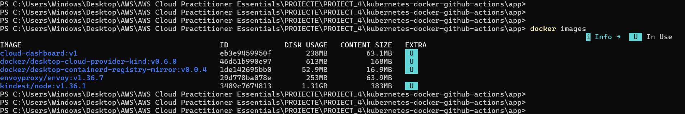

This screenshot shows the Docker images created for the Cloud Dashboard application. It documents the containerization stage and the application image versions used throughout the project.

### 02 — Docker Container Running

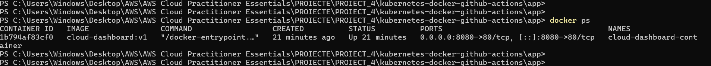

This screenshot shows the Cloud Dashboard running inside a Docker container with Nginx serving the application. It confirms that the containerized application runs successfully before being introduced into Kubernetes.

### 03 — Application Running

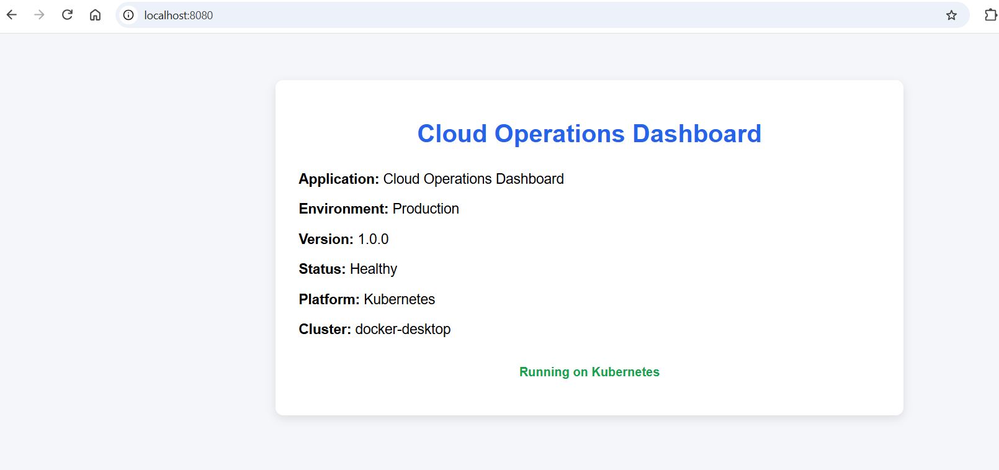

This screenshot shows the Cloud Operations Dashboard running successfully in the browser. The application provides the workload used throughout the Docker and Kubernetes demonstrations.

### 04 — Kubernetes Cluster

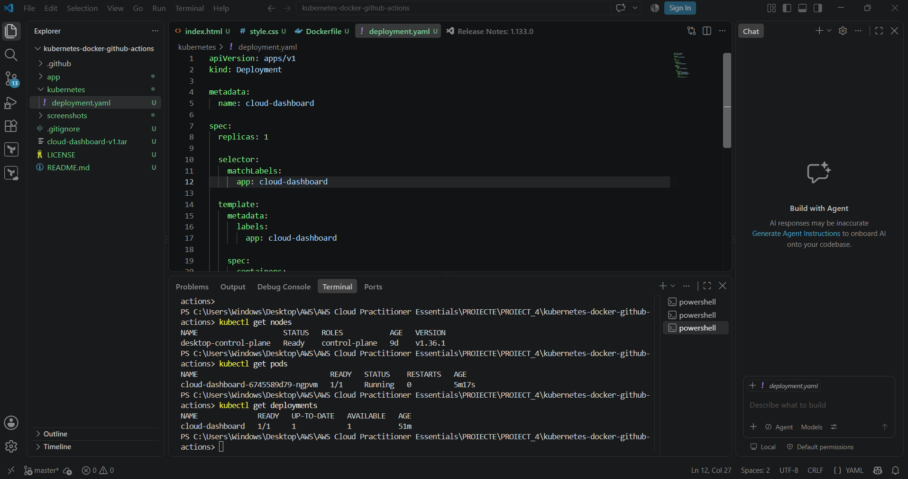

This screenshot shows the Kubernetes workload running on the local Docker Desktop Kubernetes cluster. It marks the transition from standalone Docker containers to Kubernetes-managed workloads.

### 05 — Kubernetes Service

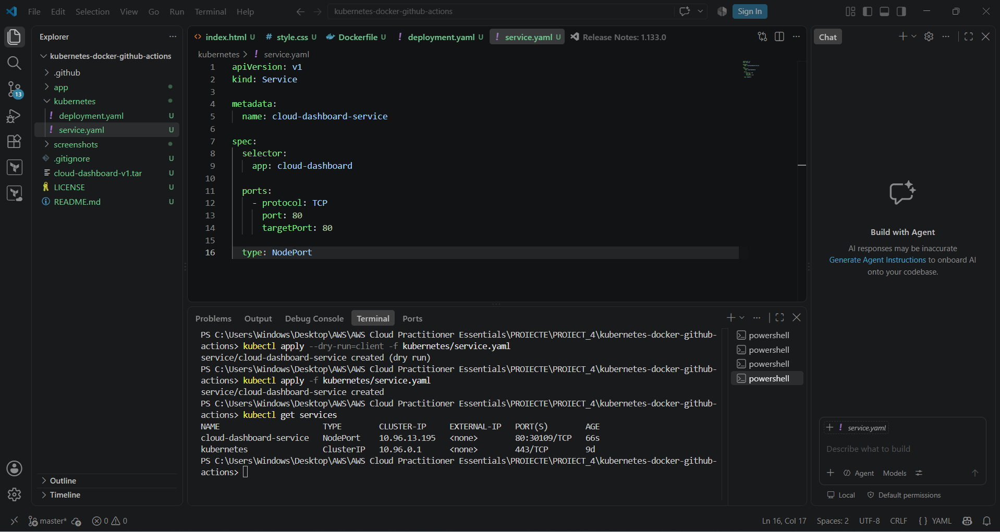

This screenshot shows the `cloud-dashboard-service` configured as a Kubernetes NodePort Service. It demonstrates how the application is exposed through a stable Service endpoint rather than accessing individual Pod IPs directly.

### 06 — Kubernetes Application

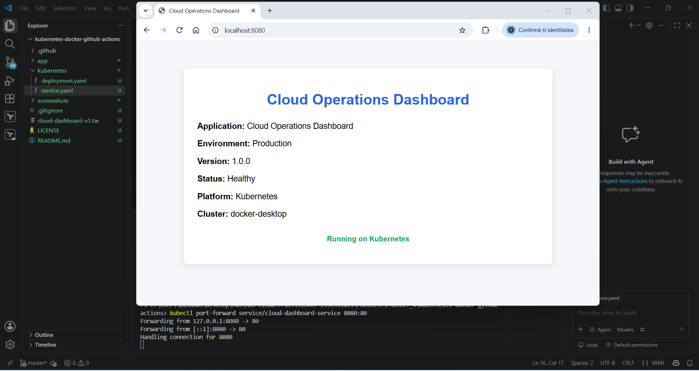

This screenshot shows the Cloud Dashboard successfully running through the Kubernetes environment. It confirms that the Deployment and Service are working together to make the application accessible.

### 07 — Kubernetes Scaling

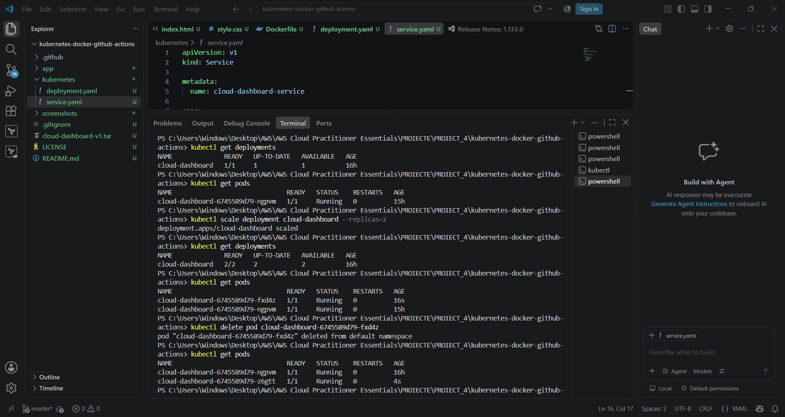

This screenshot demonstrates the application running with two Kubernetes replicas. The two Pods are managed by the Deployment, providing the desired replica count and enabling the self-healing demonstration.

### 08 — ConfigMap

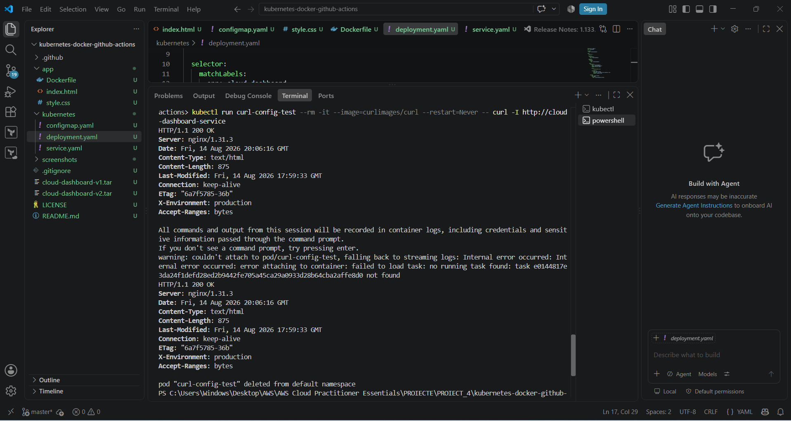

This screenshot shows the Nginx configuration managed through a Kubernetes ConfigMap. The configuration was mounted into the container and validated through the `X-Environment: production` HTTP response header.

### 09 — Rolling Update

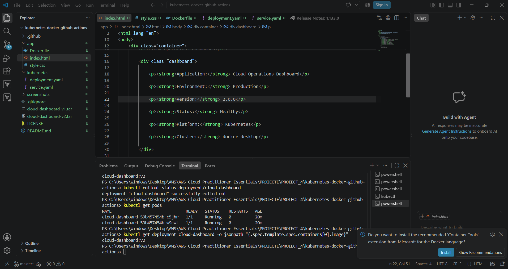

This screenshot demonstrates the Kubernetes Rolling Update from `cloud-dashboard:v1` to `cloud-dashboard:v2`. The Deployment performed the update while maintaining the application workload.

### 10 — Health Checks & Resources

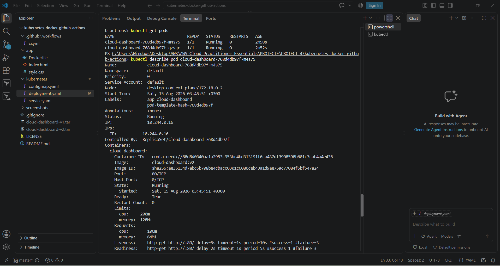

This screenshot verifies the liveness and readiness probes configured for the application, with the Pods reporting `Ready: True`. It also shows the CPU and memory requests and limits applied to the container.

### 11 — GitHub Actions

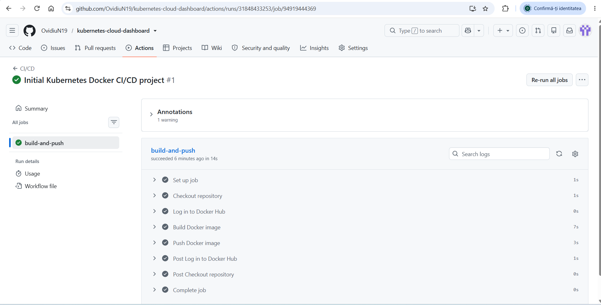

This screenshot shows the successful GitHub Actions CI/CD workflow. The pipeline checks out the repository, authenticates with Docker Hub, builds the Docker image, and pushes it to the registry.

### 12 — Docker Hub

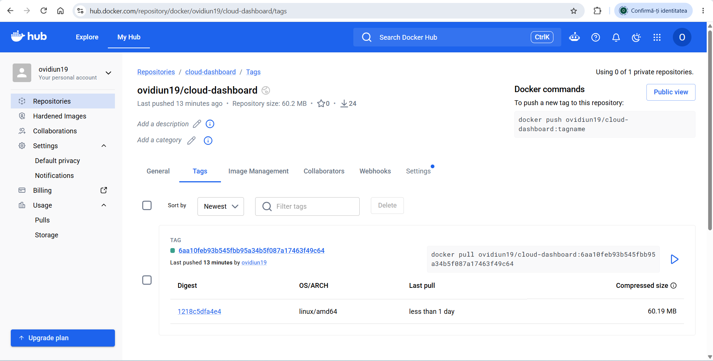

This screenshot shows the `ovidiun19/cloud-dashboard` image published to Docker Hub by the CI/CD pipeline. The image is tagged using the GitHub commit SHA, providing traceability between the image and its source commit.

### 13 — Final Result

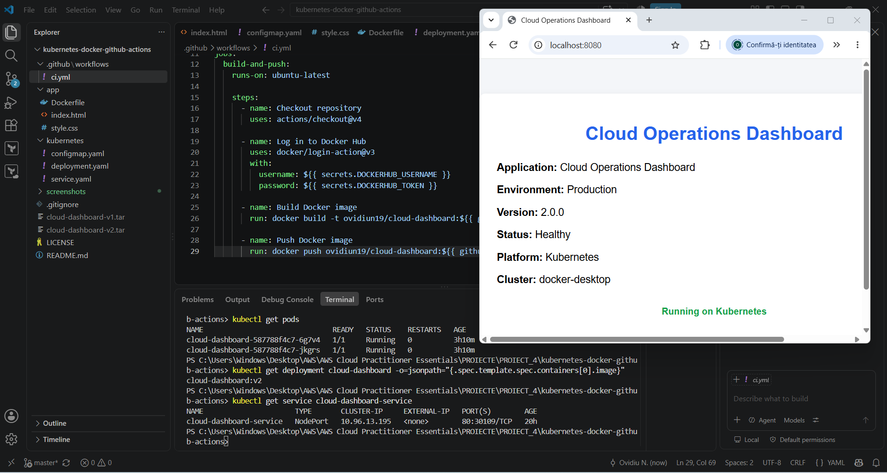

This screenshot presents the final state of the Cloud Dashboard after completing the Docker, Kubernetes, and CI/CD stages. It provides the final visual verification of the application and its Kubernetes-managed workload.

---

## Cleanup

The project uses a local Docker Desktop Kubernetes environment, so no cloud infrastructure cleanup is required.

Temporary Docker image archives are excluded from Git using:

```text
*.tar
```

---

## Future Improvements

Possible future extensions include:

- Automated Kubernetes deployment from GitHub Actions
- Deployment to a managed Kubernetes service such as Amazon EKS
- HTTPS and Kubernetes Ingress
- Environment-specific configurations
- Additional observability and monitoring

These features are **not part of the current implementation**.

---

## Contact

**GitHub:** https://github.com/OvidiuN19
